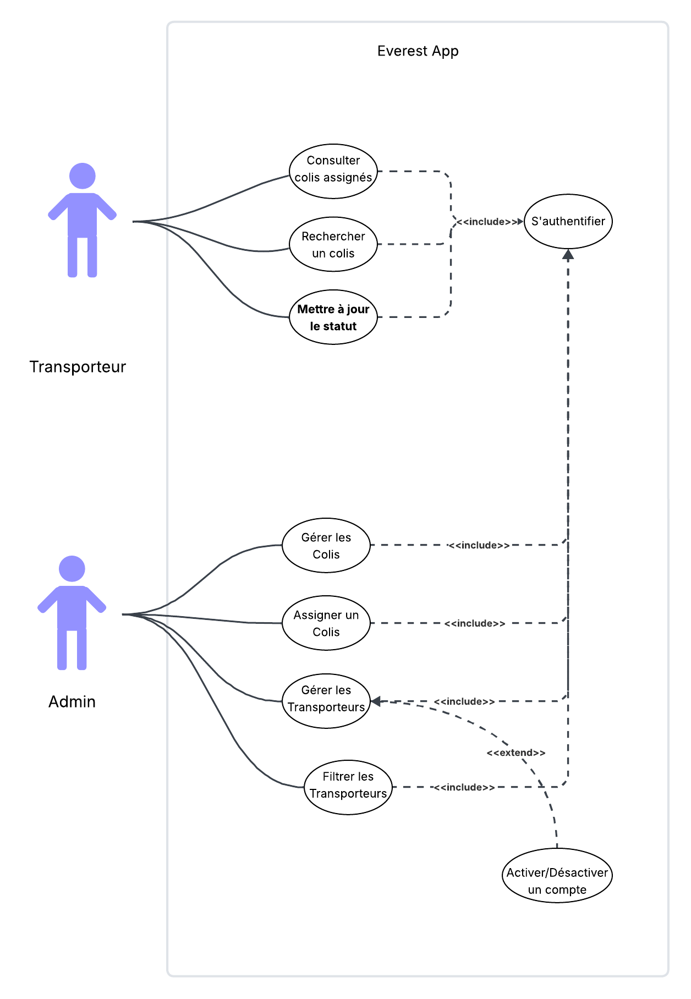
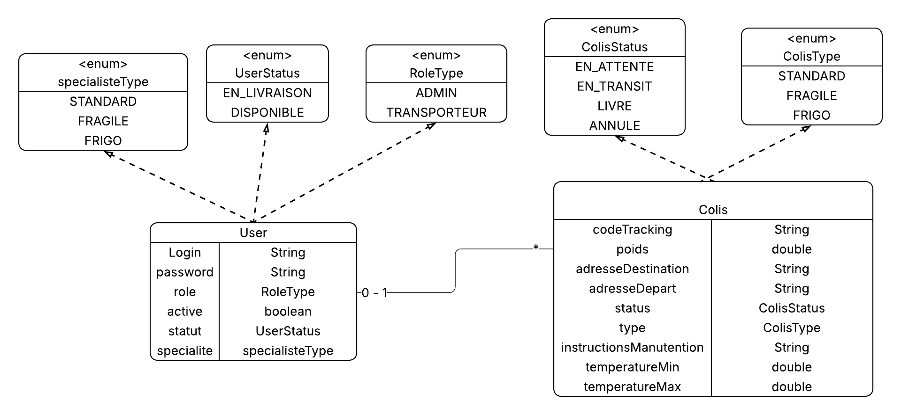

# 📦 LogiTrack - Système de Gestion de Colis et Transporteurs


## 📋 Description du Projet

**LogiTrack** est une API REST moderne développée avec Spring Boot pour la gestion de colis et de transporteurs dans une entreprise de logistique. Le système utilise MongoDB pour exploiter la flexibilité des schémas NoSQL et implémente une authentification JWT stateless pour sécuriser les accès.

### 🎯 Objectifs

- Gérer différents types de colis (STANDARD, FRAGILE, FRIGO)
- Assigner des colis aux transporteurs selon leur spécialité
- Authentification sécurisée avec JWT
- Architecture en couches respectant les design patterns
- Conteneurisation complète avec Docker

---

## 🏗️ Architecture Technique

### Stack Technologique

- **Backend:** Spring Boot 3.2+
- **Base de données:** MongoDB (NoSQL)
- **Sécurité:** Spring Security + JWT
- **Build Tool:** Maven
- **Conteneurisation:** Docker & Docker Compose
- **CI/CD:** GitHub Actions
- **Tests:** JUnit 5 + Mockito

### Structure du Projet

```
logitrack/
├── src/
│   ├── main/
│   │   ├── java/org/example/logitrack/
│   │   │   ├── config/           # Configuration (Security, MongoDB)
│   │   │   ├── controllers/      # REST Controllers
│   │   │   ├── entities/
│   │   │   │   ├── models/       # Entités MongoDB
│   │   │   │   ├── dto/          # Data Transfer Objects
│   │   │   │   └── enums/        # Énumérations
│   │   │   ├── mappers/          # MapStruct Mappers
│   │   │   ├── repositories/     # Spring Data MongoDB
│   │   │   ├── security/         # JWT Utils & Filters
│   │   │   └── services/         # Business Logic
│   │   └── resources/
│   │       └── application.properties
│   └── test/                     # Tests unitaires
├── Dockerfile
├── docker-compose.yml
├── pom.xml
└── README.md
```

---

## 📊 Modèle de Données

### Collection `users`

```json
{
  "_id": "ObjectId",
  "login": "string",
  "password": "string (BCrypt)",
  "role": "ADMIN | TRANSPORTEUR",
  "active": "boolean",
  "statut": "DISPONIBLE | EN_LIVRAISON (TRANSPORTEUR uniquement)",
  "specialite": "STANDARD | FRAGILE | FRIGO (TRANSPORTEUR uniquement)"
}
```

### Collection `colis`

```json
{
  "_id": "ObjectId",
  "type": "STANDARD | FRAGILE | FRIGO",
  "poids": "number",
  "adresseDestination": "string",
  "statut": "EN_ATTENTE | EN_TRANSIT | LIVRE | ANNULE",
  "transporteur": "DBRef<User>",
  
  // Champs conditionnels selon le type
  "instructionsManutention": "string (FRAGILE)",
  "temperatureMin": "number (FRIGO)",
  "temperatureMax": "number (FRIGO)"
}
```

### Règles Métier

✅ Un colis ne peut être assigné qu'à un transporteur ayant la spécialité correspondante  
✅ Un transporteur ne peut avoir qu'une seule spécialité  
✅ Un utilisateur désactivé ne peut pas se connecter  
✅ Les colis FRAGILE nécessitent des instructions de manutention  
✅ Les colis FRIGO nécessitent des températures min/max valides

---

## 🚀 Installation et Démarrage

### Prérequis

- Java 17+
- Maven 3.8+
- Docker & Docker Compose
- MongoDB 7.0+ (ou via Docker)

### 1️⃣ Cloner le Projet

```bash
git clone https://github.com/zakariaeelhassad/LogiTrack.git
cd logitrack
```

### 2️⃣ Configuration

Créer `src/main/resources/application.properties`:

```properties
# MongoDB
spring.data.mongodb.uri=mongodb://localhost:27017/logitrack
spring.data.mongodb.database=logitrack

# JWT Configuration
jwt.secret=votre_secret_key_minimum_32_caracteres_ici
jwt.issuer=logitrack
jwt.expiration=86400000

# Server
server.port=8080

# Logging
logging.level.org.example.logitrack=DEBUG
```

### 3️⃣ Lancer avec Docker Compose (Recommandé)

```bash
docker-compose up --build
```

L'application sera accessible sur `http://localhost:8080`

### 4️⃣ Lancer en Développement

```bash
# Démarrer MongoDB
docker run -d -p 27017:27017 --name mongodb mongo:7.0

# Compiler et lancer l'application
mvn clean install
mvn spring-boot:run
```

---

## 📡 Documentation API

### Swagger UI

Une fois l'application lancée, accédez à:
```
http://localhost:8080/swagger-ui.html
```

### Endpoints Principaux

#### 🔐 Authentification

| Méthode | Endpoint | Description | Accès |
|---------|----------|-------------|-------|
| POST | `/api/auth/login` | Connexion | Public |

#### 👨‍💼 Gestion des Utilisateurs (ADMIN)

| Méthode | Endpoint | Description |
|---------|----------|-------------|
| GET | `/api/admin/users` | Liste tous les utilisateurs |
| GET | `/api/admin/transporteurs` | Liste des transporteurs |
| GET | `/api/admin/transporteurs/specialite/{specialite}` | Filtrer par spécialité |
| POST | `/api/admin/transporteurs` | Créer un transporteur |
| PUT | `/api/admin/transporteurs/{id}` | Modifier un transporteur |
| DELETE | `/api/admin/transporteurs/{id}` | Supprimer un transporteur |
| PUT | `/api/admin/users/{id}/activate` | Activer un utilisateur |

#### 📦 Gestion des Colis (ADMIN)

| Méthode | Endpoint | Description |
|---------|----------|-------------|
| GET | `/api/admin/colis` | Liste tous les colis |
| GET | `/api/admin/colis/search` | Rechercher par adresse |
| POST | `/api/admin/colis` | Créer un colis |
| PUT | `/api/admin/colis/{id}/assign` | Assigner à un transporteur |
| PUT | `/api/admin/colis/{id}` | Modifier un colis |
| PATCH | `/api/admin/colis/{id}/statut` | Mettre à jour le statut |
| DELETE | `/api/admin/colis/{id}` | Supprimer un colis |

#### 🚚 Gestion des Colis (TRANSPORTEUR)

| Méthode | Endpoint | Description |
|---------|----------|-------------|
| GET | `/api/transporteur/colis` | Mes colis |
| GET | `/api/transporteur/colis/search` | Rechercher mes colis |
| PATCH | `/api/transporteur/colis/{id}/statut` | Mettre à jour le statut |

---

## 💡 Exemples d'Utilisation

### 1. Authentification

```bash
curl -X POST http://localhost:8080/api/auth/login \
  -H "Content-Type: application/json" \
  -d '{
    "login": "admin",
    "password": "admin123"
  }'
```

**Réponse:**
```json
{
  "token": "eyJhbGciOiJIUzI1NiIsInR5cCI6IkpXVCJ9...",
  "user": {
    "id": "67891234abcd5678ef901234",
    "login": "admin",
    "role": "ADMIN",
    "active": true
  }
}
```

### 2. Créer un Transporteur (ADMIN)

```bash
curl -X POST http://localhost:8080/api/admin/transporteurs \
  -H "Authorization: Bearer {TOKEN}" \
  -H "Content-Type: application/json" \
  -d '{
    "login": "transporteur1",
    "password": "pass123",
    "role": "TRANSPORTEUR",
    "statut": "DISPONIBLE",
    "specialite": "STANDARD"
  }'
```

### 3. Créer un Colis FRAGILE (ADMIN)

```bash
curl -X POST http://localhost:8080/api/admin/colis \
  -H "Authorization: Bearer {TOKEN}" \
  -H "Content-Type: application/json" \
  -d '{
    "type": "FRAGILE",
    "poids": 2.5,
    "adresseDestination": "123 Rue Mohamed V, Casablanca",
    "instructionsManutention": "Manipuler avec précaution"
  }'
```

### 4. Assigner un Colis à un Transporteur (ADMIN)

```bash
curl -X PUT http://localhost:8080/api/admin/colis/{colisId}/assign \
  -H "Authorization: Bearer {TOKEN}" \
  -H "Content-Type: application/json" \
  -d '{
    "transporteurId": "507f191e810c19729de860ea"
  }'
```

### 5. Récupérer Mes Colis (TRANSPORTEUR)

```bash
curl -X GET "http://localhost:8080/api/transporteur/colis?page=0&size=10" \
  -H "Authorization: Bearer {TOKEN}"
```

---

## 🧪 Tests

### Lancer les Tests Unitaires

```bash
mvn test
```

### Lancer les Tests avec Couverture

```bash
mvn test jacoco:report
```
### Screenshots




